# PokéDuel 

**Developer: Stanimir Vasev**

[Visit live website](https://stanimirvasev.github.io/ci-interactive-frontend-development-milestone-project/)

## Table of Content

- [PokéDuel ](#pokéduel-)
  - [Table of Content](#table-of-content)
  - [Project Goals](#project-goals)
    - [User Goals](#user-goals)
    - [Site Owner Goals](#site-owner-goals)
  - [User Experience](#user-experience)
    - [Target Audience](#target-audience)
    - [User Requirements](#user-requirements)
    - [User Expectations](#user-expectations)
  - [User Stories](#user-stories)
    - [Site User](#site-user)
    - [Site Owner](#site-owner)
  - [Design](#design)
    - [Colour Scheme](#colour-scheme)
    - [Fonts](#fonts)
    - [Structure](#structure)
    - [Wireframes](#wireframes)
  - [Technologies Used](#technologies-used)
    - [Languages](#languages)
    - [Frameworks, Libraries \& Tools](#frameworks-libraries--tools)
  - [Existing features](#existing-features)
    - [Game Menu](#game-menu)
    - [Pokedex Area](#pokedex-area)
    - [Home Page](#home-page)
    - [Duel Area](#duel-area)
    - [End Game Modal](#end-game-modal)
    - [Footer](#footer)
  - [Future features](#future-features)
  - [Validation](#validation)
    - [W3C validator testing](#w3c-validator-testing)
  - [Testing](#testing)
    - [Lighthouse](#lighthouse)
    - [Known Bugs](#known-bugs)
  - [Deployment](#deployment)
    - [GitHub Pages](#github-pages)
  - [Credits](#credits)
    - [Copy](#copy)
    - [Images, icons, music](#images-icons-music)
    - [Code](#code)
  - [Acknowledgements](#acknowledgements)

## Project Goals

The goal of this project was to develop an interactive and user-friendly Pokémon-themed adaptation of the traditional rock, paper, scissors game.

### User Goals

- Provide an entertaining and engaging gameplay environment that captivates users and makes the game enjoyable.
- Ensure the game offers straightforward navigation and gameplay suitable for users of all ages, promoting an inclusive experience.
- Allow players to immerse themselves in the Pokémon universe, fostering a sense of connection and familiarity.
- Create a user interface and gameplay that require minimal instruction, facilitating easy understanding and interaction.
- Establish a fair gaming space that challenges users' strategies while maintaining an enjoyable experience.
- Offer a replay option that encourages users to replay the game, ensuring continued enjoyment and engagement.

### Site Owner Goals

- Develop a game with captivating gameplay mechanics, storylines, and challenges to sustain user interest and enjoyment throughout the gaming experience.
- Create an interface with visually striking elements that reflect the Pokémon theme while ensuring ease of use. Simplify navigation to facilitate seamless transitions between game sections.
- Maintain the core essence of the Pokémon universe in the game design, including pokemons, types, and environment, to immerse players in the familiar and beloved world.
- Optimise the game to be fully responsive and accessible across various devices (e.g. Galaxy fold, iPhone 12 Pro, tablet, desktop), accommodating users of diverse abilities and preferences.

## User Experience

### Target Audience

- Fans of the Pokémon universe intrigued by a new gaming experience based on the iconic "rock, paper, scissors" concept set within the Pokémon world.
- Players who enjoy strategy-based games and are attracted to the competitive dynamics of "rock, paper, scissors" gameplay with a Pokémon theme.
- Individuals of various age groups seeking straightforward yet engaging entertainment within the immersive Pokémon universe, presented through the classic "rock, paper, scissors" format.

### User Requirements

- Compatible with most modern devices (list specifics if necessary, e.g., iOS, Android, PC).
- A stable internet connection for seamless gameplay.
  
### User Expectations

- Simplified interface.
- Easy to understand game rules.
- Pokémon world integration.
- Suitable and enjoyable experience for diverse age groups without complex learning curves.
- All in-game links and buttons are expected to seamlessly navigate to their designated destinations without errors or delays.
- The game ensures that actions taken lead to expected results, maintaining consistency and clarity throughout the gameplay experience.
- Accessibility on all devices
- Developer contact information

## User Stories

### Site User

1. I want to understand the game concept easily.
2. I want to have clearly defined game rules that are easily accessible on all pages.
3. I want to have different pokemon images being displayed on every turn.
4. I want to be able to track my score vs computer score.
5. I want to see the computer's decision on every turn.
6. I want personalised outcome when the game finishes.
6. I want to be able to play the game across multiple devices.
7. I want to be able to get in touch with the developer via social media.
8. I want to be able to find the source code for the game so I can duplicate and improve in my own time.

### Site Owner

1. I want the user to have a seamless experience no matter what age they are or what device they use.
2. I want the user to clearly understand the game rules throughout the game.
3. I want the user to be able to navigate back and forth between game areas.
4. I want the user to be able to understand the different types of pokemons easily based on icons.
5. I want the user to have fun interacting with different pokemons throughout each turn.
6. I want the user to get a personalised response once the game finishes.
7. I want the user to be able to replay the game.
8. I want the user to be able to find me on social media platforms.
9. I want the user to be able to duplicate my code and improve it.

## Design

### Colour Scheme

The color scheme maintained simplicity and consistency throughout the screens, drawing inspiration from the iconic colours found in the original Pokémon game.

- The pokeball colour was found on [Color Hex](https://www.color-hex.com/color-palette/1045).
- A vibrant, recognisable hue (#ffc700) akin to the iconic Pokémon yellow was utilised for headings, buttons, and various highlights throughout the interface.
- Classic black and white colours were utilised for text elements and background contrasts as black (#000000) and white (#ffffff) play pivotal roles in ensuring readability and visual balance across screens.

The pallet used was created on [Coolors.co](https://coolors.co/ffc700-ffad00-ee1515-ffffff-0366d6)

This palette aims to evoke nostalgia while ensuring a cohesive visual experience across the screens.

### Fonts

Pokemon Solid and Pokemon Normal, custom fonts added via @font-face, were carefully selected to emphasise the Pokémon theme, gracing headings and body text.

As a backup option, the Montserrat and sans-serif fonts, imported from Google Fonts, was employed to impart a modern and sleek appearance throughout various interface elements.

### Structure

The website's layout was intentionally created to facilitate effortless navigation and user understanding. Each game screen resides within a unified container, fostering a cohesive arrangement that maintains harmony among all elements.

The game consist of the following screens:

- Home page which shows menu icons(e.g. Home, Volume, Pokedex), introduction text, user name input, button and social media icons
- Duel area where the game player battles the computer in the rock, paper, scissors Pokemon themed game which includes 3 types of pokemons (water, fire, grass) with are located in a pokeball looking container and includes pokemon images that change on each turn.
- Pokedex icon is displayed on all screens so users can easily access the game instructions via a pokedex modal.
- End Game result modal pops up as soon as any of the players reaches 10 points, which displays 2 outcomes (win or lose) featuring a gif and some personalised copy and a replay button.

### Wireframes

Desktop wireframe

Tablet wireframe

Mobile wireframe

## Technologies Used

### Languages

- HTML5
- CSS3
- JavaScript

### Frameworks, Libraries & Tools

- Font Awesome was used to access the hone, pokedex, volume up and volume mute icons.
- Google Fonts was used to access Montserrat and sans-serif fonts.
- GitHub was used to streamline version control.

## Existing features

### Game Menu

- Includes navigation to home page, volume control, and access to the Pokédex on all screens. Hover effect is used for more interactivity and visual appeal.
- Volume control toggles between sound on and off.
- Pokédex provides information on how to play the game.

### Pokedex Area

- Offers a brief introduction to the game mechanics, describing the Pokémon-themed version of rock-paper-scissors and how players can win against the computer. It's a modal window that appears when the Pokedex icon is clicked and once double-clicked, it returns to the previous screen.

### Home Page

- Welcomes users to the game.
- Prompts users to enter their name to start the game.
- Provides clear instructions for input length and functionality. The player's name needs to be maximum 12 characters long. The are no restrictions on characters type.
- Offers a 'Start duel' button to initiate the game. Hover effect is used for more interactivity and visual appeal.

### Duel Area

- Displays Pokémon images representing Water, Fire, and Grass types.
- Allows users to select their choice against the computer. Pokemon images of each type are randomly generated on each turn to make the game more interesting and allow users to immerse themselves in the Pokemon world.
- Highlights the outcome of each turn with clear messages (e.g. what the computer has selected).
- Shows the player's and computer's scores and dynamically updates them on each turn.

### End Game Modal

- Appears when a player wins or loses the game. Score required to finish the game is 10.
- Displays a congratulatory message or an encouragement to try again. 2 pokemon gifs showing Pikachu are used to make it more interesting.
- Provides an option to play the game again. Hover effect is used for more interactivity and visual appeal.

### Footer

- Contains information about the developer, his social media links and github repository. Hover effect is used for more interactivity and visual appeal.

## Future features

- Implement user accounts to allow for personalized experiences, saved progress, or statistics tracking.
- Introduce multiplayer functionality, enabling users to compete against each other in real-time.
- Expand the game mechanics or introduce new challenges, levels, or Pokemon types for added variety.
- Incorporate more animations, visual effects, or interactive elements to enhance the overall user experience.
- Implement leaderboards to showcase high scores and encourage competition among players.

## Validation

### W3C validator testing

- [HTML validator](https://validator.w3.org/): 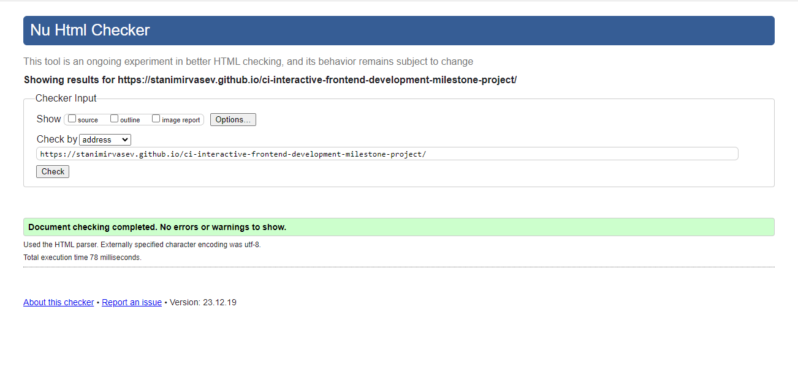
- [CSS validator](https://jigsaw.w3.org/css-validator/): 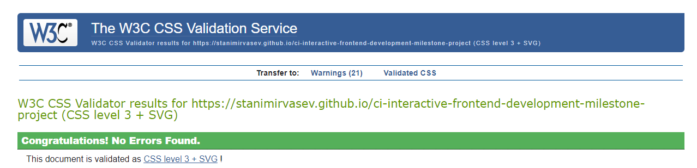
- [JavaScript validator](https://jshint.com/): 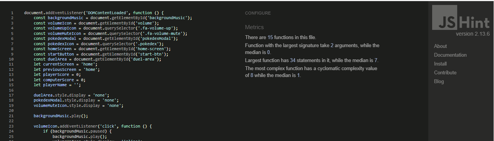

## Testing

- I've tested the website using Chrome Developer Tools to check how it handles different screen sizes. No matter if you're on a computer, phone (Galaxy Fold or iPhone12 Pro), or tablet, the website keeps its smooth performance intact. It shines on desktops and keeps a decent experience on smaller screens too!

Desktop view

Home page view

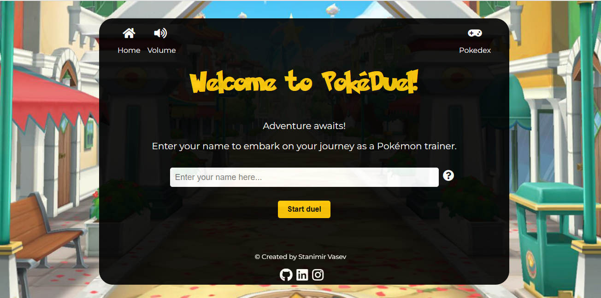

Pokedex view

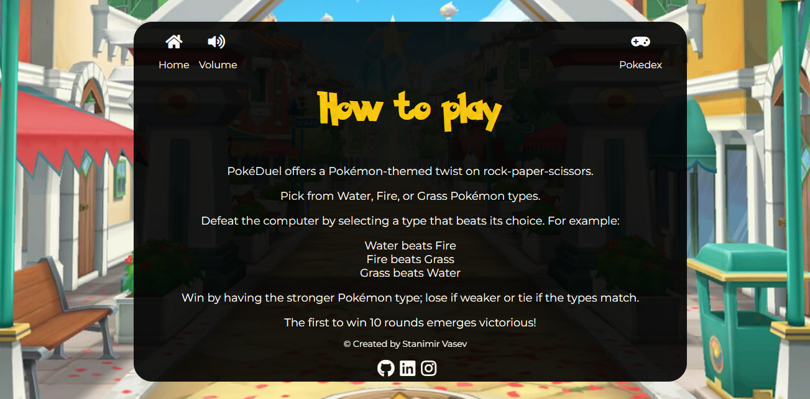

Duel area view

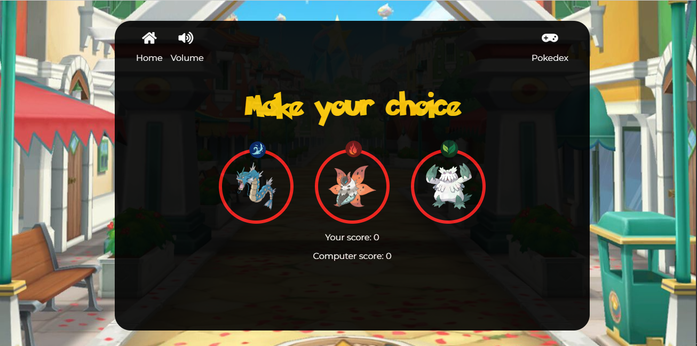

End Game view

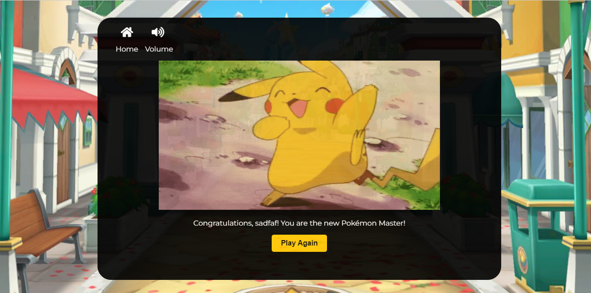

Tablet view

Home page view

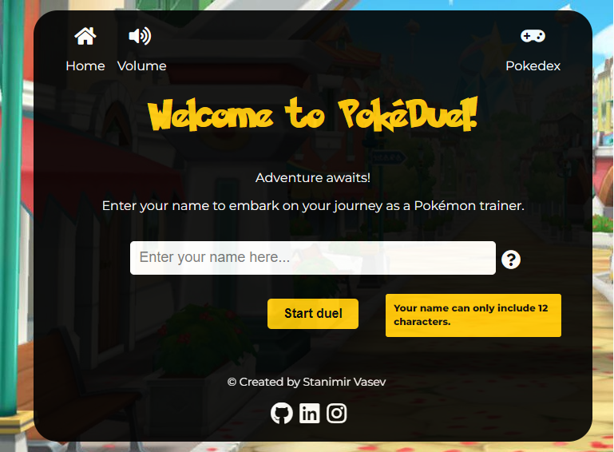

Pokedex view

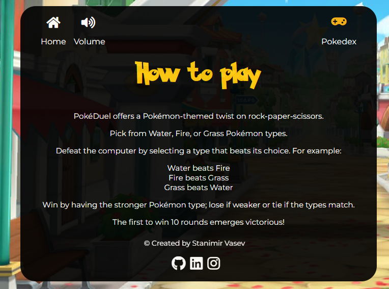

Duel area view

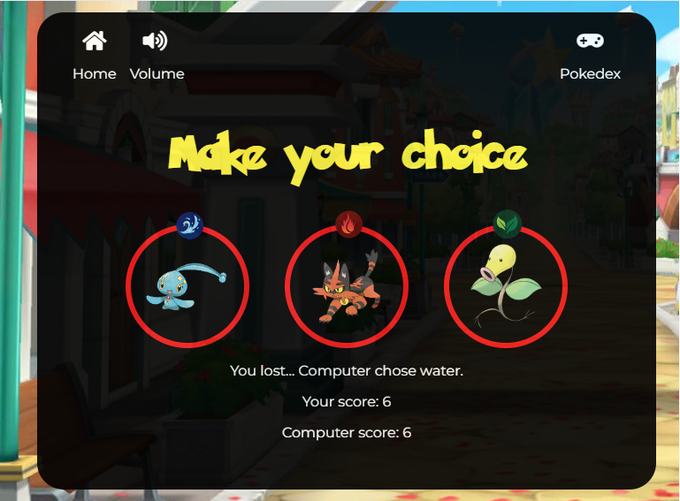

End Game view

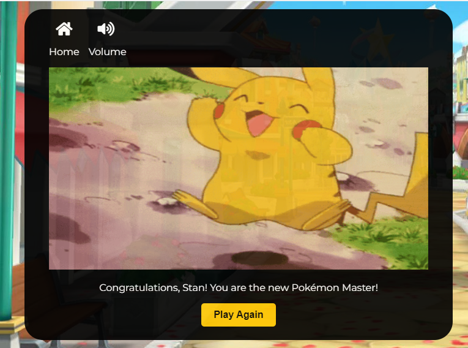

Mobile view

Galaxy Fold view

Home page view

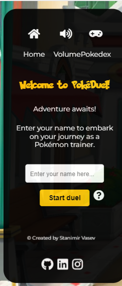

Pokedex view

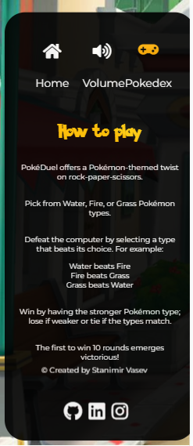

Duel area view

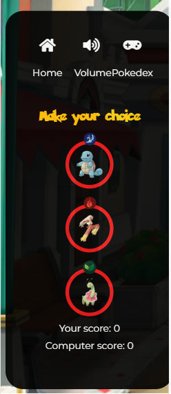

End Game view

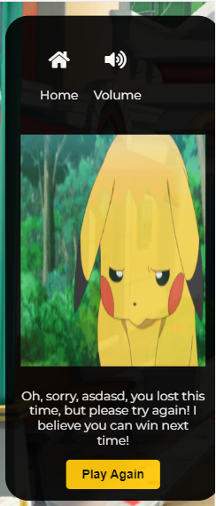

iPhone 12 Pro view

Home page view

Pokedex view

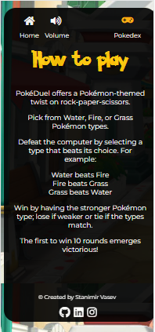

Duel area view

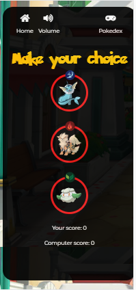

End Game view

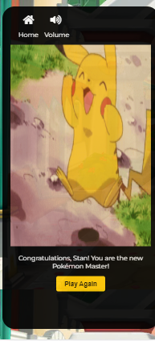

### Lighthouse

- I took the website through a detailed check-up using Lighthouse in Chrome Developer Tools. It looked at SEO, accessibility, performance, and best practices. Check out the results below:
  
  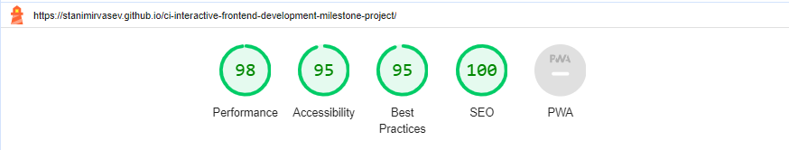

### Known Bugs

- Background image repeats rather than covers the smaller screens due to low image resolution.
- Pokedex icon disappears during the End Game area intentionally as I tried making it work to return to endgame area and not the duel-area but I couldn't find the solution to fix it although it looked similar to my current JS logic.
- Responsiveness across different browsers and screens isn't perfect. The game is best played on desktop. I added a few media queries to cover 2 phone types, tablet and desktop but more work is needed.
- Pokemon Normal font do not load in parallel with other fonts.

## Deployment

### GitHub Pages

  1. The site was deployed by using GitHub Pages. You can replicate this process by going to [Github](https://github.com/StanimirVasev/ci-interactive-frontend-development-milestone-project), click on the 'Settings' tab, then select 'Pages' on the left side.
  2. Under 'Build and deployment' section, select 'Deploy as a branch' as the Source.
  3. Select 'main' as the branch and '/(root)' as the folder and click 'Save'.
  4. Once saved, GitHub will refresh and your website will be publishd from GitHub repository.
  5. The link to your published website will appear on the top of the page.

## Credits

### Copy

- The copy you can see on the page was created by the developer.

### Images, icons, music

- Icons in game menu and footer were taken from [Fontawesome](https://www.fontawesome.com/).
- Original Pokemon theme song was taken from [Television Tunes](https://www.televisiontunes.com/Pokemon).
- Favicon was taken from [Icons 8](https://www.icons8.com/icons/set/pokeball).
- Background image was taken from [Pokemon](https://www.pokemon.com/uk/pokemon-virtual-backgrounds/).
- Type images (water, fire, grass) were created by the developer using [Canva](https://www.canva.com).
- Pokemon images were taken from [Bulbapedia](https://www.bulbapedia.bulbagarden.net/wiki/Type).
- You won gif was taken from [Tenor](https://www.tenor.com/bg/view/pikachu-gif-21053665).
- You lost gif was taken from [Tenor](https://www.tenor.com/bg/view/pokemon-pikachu-pok%C3%A9mon-gif-15130256888716170546).

### Code

- Overall game design (including game box and menu design) was inspired by the Code Institute Student Project example from [Mike Ralph](https://www.miker94.github.io/CI-Project-Portfolio-2/).
- Rock, paper, scissors game idea was inspired by [Dulce and Eduardo Hernand](https://github.com/iamdulce/rock-paper-scissors-).
- Footer was inspired by the Code Institute Student Project example from [Aleksandra Haniok](https://www.aleksandracodes.github.io/CI_PP2_SunshineGuessing/).

## Acknowledgements

Special thanks to my Code Institute mentor Rohit Sharma for all the support.
